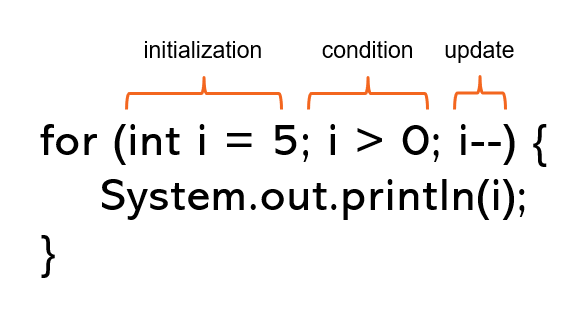

# Instructions
In this activity you will learn how to use a for-loop. Recall that a loop is an iterative statement that repeats a block of code until its condition evalautes to `false`. Although the for-loop looks syntactically very different from the previous two loops we've learned about, it still follows the same steps: a variable is created an initialized and the loop has a condition, code block, and update statement.

The main difference with the for-loop is where all of the steps are defined. Look at the below image for an example of a for loop:


Notice that the **for** keyword is used, and then right after is a set of parameters inside parenthesis. Each parameter is a statement:
- the first statement initializes a variable
- the second statement provides the loops condition
- the third statement updates the variable so that eventually the loop will end

Please follow the steps below:

### Steps:
1. Copy and paste the following code into the **main()** method:
```Java
for (int i = 5; i > 0; i--) { 
    System.out.println(i);
}
```
This is an example of a for-loop. When a for-loop executes, it begins with the initialization statement, then it checks the condition. If the condition evaluates to `true`, the code block runs. After the code block runs, the update statement executes and the next iteration starts with checking the condition again. The loop ends when the condition evaluates to `false`.

When you run the program, you'll notice the output is every number between `5` and `1` (inclusive).

2. Below the code you have so far in the **main()** method, create a for-loop to print `1` - `100`.

### Test:
Use the test provided. 

#### Sample output:
```
5
4
3
2
1
1
2
3
4
5
6
7
8
9
10
11
12
13
14
15
16
17
18
19
20
21
22
23
24
25
26
27
28
29
30
31
32
33
34
35
36
37
38
39
40
41
42
43
44
45
46
47
48
49
50
51
52
53
54
55
56
57
58
59
60
61
62
63
64
65
66
67
68
69
70
71
72
73
74
75
76
77
78
79
80
81
82
83
84
85
86
87
88
89
90
91
92
93
94
95
96
97
98
99
100
```